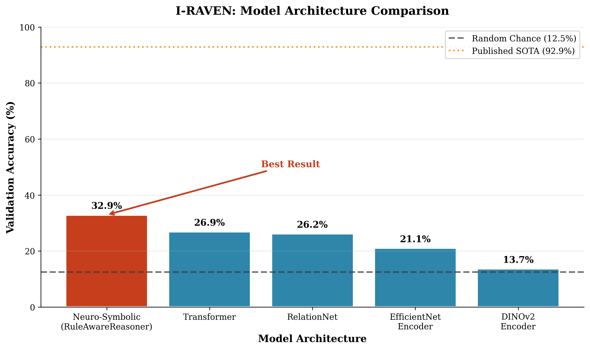
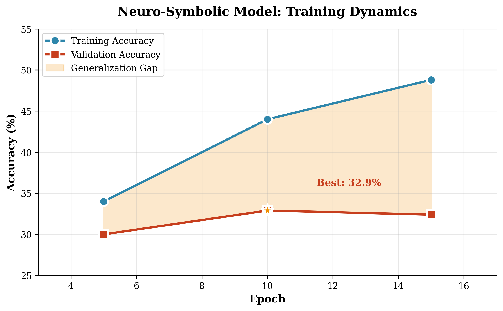
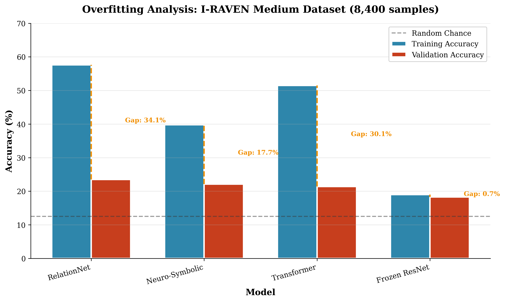
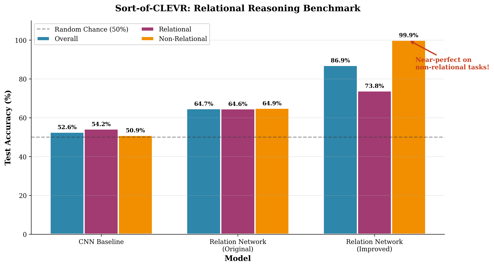

# RAVEN RPM Solver — Evaluation Results

> **Generated:** December 2024 | **Experiments:** 22 total | **Datasets:** I-RAVEN, Sort-of-CLEVR

---

## Executive Summary

| Benchmark | Best Model | Accuracy | SOTA |
|-----------|------------|----------|------|
| **I-RAVEN** | Neuro-Symbolic (RuleAwareReasoner) | **32.9%** | 92.9% |
| **Sort-of-CLEVR** | Improved Relation Network | **86.9%** | — |

---

## I-RAVEN Results

### Model Comparison

| Model | Val Accuracy | Parameters | Notes |
|-------|-------------|------------|-------|
| **Neuro-Symbolic** | **32.9%** | 12.9M | Best result ✓ |
| Transformer | 26.9% | 13.7M | Competitive |
| RelationNet | 26.2% | 12.1M | Structure-aware |
| EfficientNet Encoder | 21.1% | 4.6M | Fast but weak |
| DINOv2 Encoder | 13.7% | 22.0M | Failed to converge |
| Random Chance | 12.5% | — | Baseline |



### Training Dynamics

Best model (Neuro-Symbolic) training progression:

| Epoch | Train Acc | Val Acc |
|-------|-----------|---------|
| 5 | 34.0% | 30.0% |
| **10** | 44.0% | **32.9%** ✓ |
| 15 | 48.8% | 32.4% |



### Overfitting Analysis

Medium dataset (8,400 samples) reveals severe generalization gap:

| Model | Train Acc | Val Acc | Gap |
|-------|-----------|---------|-----|
| RelationNet | 57.6% | 23.5% | 34.1% |
| Neuro-Symbolic | 39.8% | 22.1% | 17.7% |
| Transformer | 51.5% | 21.4% | 30.1% |



---

## Sort-of-CLEVR Results

### Performance Breakdown

| Model | Overall | Relational | Non-Relational | Params |
|-------|---------|------------|----------------|--------|
| **Improved RN** | **86.9%** | 73.8% | **99.9%** | 1.76M |
| Original RN | 64.7% | 64.6% | 64.9% | 295K |
| CNN Baseline | 52.6% | 54.2% | 50.9% | 4.6M |

**Key improvement:** Matching original paper specs (+22.2% accuracy gain)



---

## Key Findings

### What Worked

1. **Neuro-symbolic reasoning** — Best I-RAVEN architecture (32.9%)
2. **Relation Networks** — Excellent for Sort-of-CLEVR (86.9%)
3. **Larger hidden dimensions** — Critical for relational reasoning
4. **Pretrained ResNet-18** — Consistent encoder across experiments

### Challenges

1. **Severe overfitting** — 20-35% train/val gaps on I-RAVEN
2. **60% gap to SOTA** — Suggests need for structural learning (SCL)
3. **Self-supervised encoders fail** — DINOv2 stuck at random chance
4. **Spatial reasoning bottleneck** — Pooling destroys positional info

### Insights for Future Work

- **SCL (Structural Consistency Learning)** suppresses overfitting but slows convergence
- **Spatial convolutional reasoners** showed promise (34% peak) but overfit badly
- **Non-relational tasks** are near-solved (99.9%); relational reasoning is the bottleneck

---

## Figures

| Figure | Description |
|--------|-------------|
| `fig1_iraven_model_comparison.png` | Bar chart comparing all I-RAVEN models |
| `fig2_training_dynamics.png` | Train/val curves showing overfitting |
| `fig3_overfitting_analysis.png` | Medium dataset generalization gap |
| `fig4_clevr_comparison.png` | Sort-of-CLEVR relational vs non-relational |
| `fig5_sota_gap.png` | Visual comparison to published SOTA |
| `fig6_experiment_progression.png` | All 9 I-RAVEN experiments chronologically |
| `fig7_parameter_efficiency.png` | Accuracy vs parameter count scatter |
| `fig8_summary_dashboard.png` | 4-panel thesis summary |
| `fig9_architecture_diagram.png` | Neuro-symbolic pipeline visualization |

---

## Regenerating Figures

```bash
source venv/bin/activate
python3 thesis_evaluation.py
```

Output: `figures/*.png` + `figures/results_table.tex`

---

## References

- **I-RAVEN SOTA:** Raven Solver (ScienceDirect 2023) — 92.9%
- **Relation Networks:** Santoro et al. 2017
- **SCL:** Structural Consistency Learning for visual reasoning
